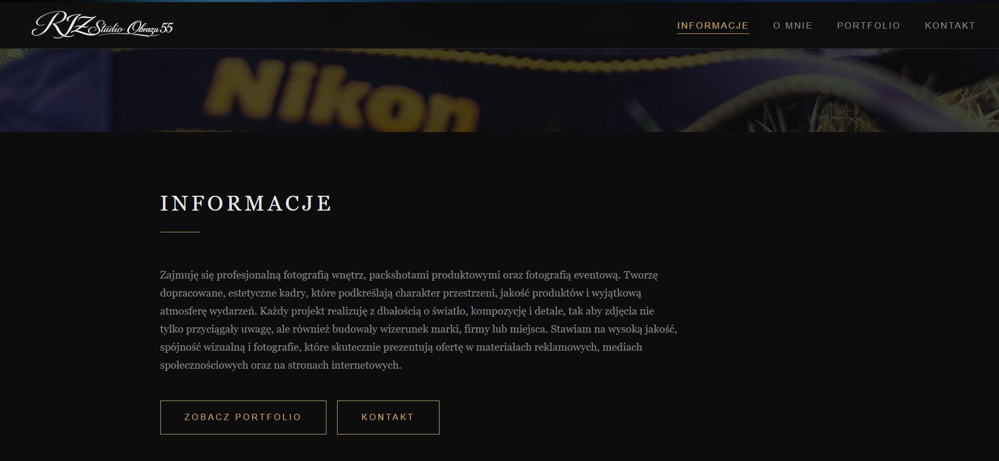
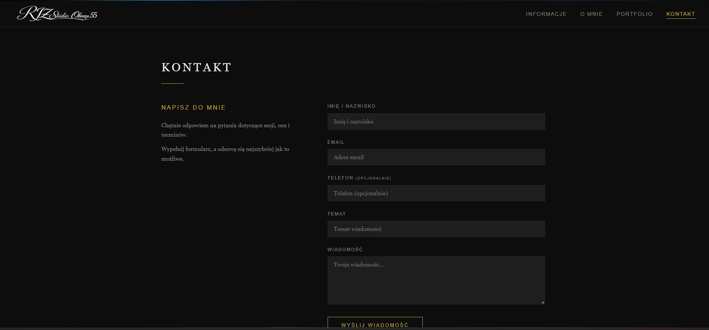
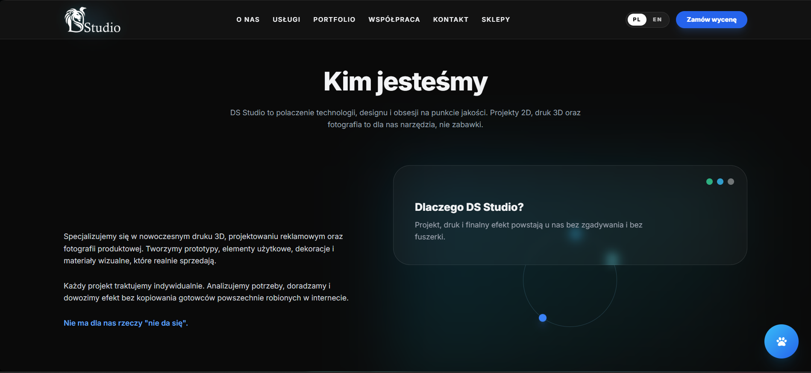
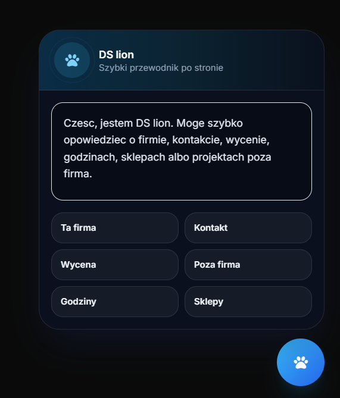
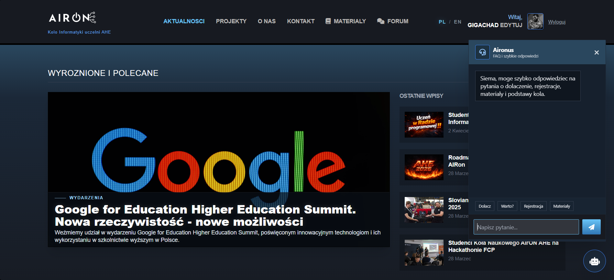

# Commercial Projects

Repozytorium prezentujące wybrane komercyjne projekty stron WWW wykonane dla klientów.

## O mnie

Tworzę nowoczesne strony internetowe dla firm i osób prywatnych.  
Zajmuję się projektowaniem, wdrażaniem oraz dopracowaniem wyglądu i działania stron pod potrzeby klienta.

## Zrealizowane projekty

---

## 1. Strona dla Fotografa 

**Typ projektu:** Strona firmowa  portfolio  
**Status:** Zrealizowany  
**Technologie:** HTML, CSS, JavaScript, Django, Tailwind  
**Zakres prac:** Projekt, wdrożenie, optymalizacja, responsywność

### Opis
Strona internetowa wykonana dla firmy oferującej usługi fotograficzne.  
Celem było stworzenie nowoczesnej i przejrzystej wizytówki online, która dobrze prezentuje ofertę i ułatwia kontakt z klientem.

### Zakres wykonanych prac
- projekt układu strony
- wdrożenie frontend
- dostosowanie do urządzeń mobilnych
- formularz kontaktowy
- optymalizacja szybkości działania
- podstawowe SEO

### Podgląd / link
[Zobacz projekt]([https://twoj-link.pl](https://www.rjz-studio-obrazu-55.pl))

### Screenshot

  
  

---

## 2. Moja strona www DS Studio

**Typ projektu:** Strona firmowa 
**Status:** Zrealizowany  
**Technologie:** HTML, CSS, JavaScript, Django, Tailwind  
**Zakres prac:** Projekt, wdrożenie, responsywność

### Opis
Krótki opis projektu.  
Przykład:  
Nowoczesna Strona internetowa stworzona dla siebie prezentująca portfolio i zakres usług.  
Projekt skupiał się na mocnym, nowoczesnym wyglądzie oraz jasnym pokazaniu usług.

### Zakres wykonanych prac
- przygotowanie struktury strony
- wdrożenie sekcji usług
- przygotowanie galerii realizacji
- wersja mobilna
- optymalizacja treści wizualnych
- robocik odpowiadający na szybkie pytania w js

### Podgląd / link
[Zobacz projekt](https://dsstudio-online.pl)

### Screenshot

  
  

---

## 3. Airon strona Koła informatycznego / rozbudowany portal webowy / aplikacja webowa w Django

**Typ projektu:** Strona uczelnianego Koła informatycznego
**Status:** Zrealizowany  
**Technologie:** HTML, CSS, JavaScript, Django, Python, SQLite  
**Zakres prac:** Projekt, wdrożenie, rozwój

### Opis
Rozbudowany portal internetowy przygotowany dla uczelnianego Koła Informatycznego. 
Projekt pełni funkcję oficjalnej strony organizacji oraz wewnętrznej platformy społecznościowej. 
Serwis łączy część informacyjną i promocyjną z funkcjami użytkowymi, takimi jak system aktualności, 
forum dyskusyjne, profile użytkowników, sekcja materiałów edukacyjnych, 
formularz kontaktowy oraz moduł projektów z możliwością zgłoszeń i akceptacji uczestników.

### Zakres wykonanych prac
- zaprojektowanie i wdrożenie pełnej strony internetowej Koła
- przygotowanie widoków dla aktualności, projektów, materiałów, forum i podstron informacyjnych
- wdrożenie systemu rejestracji, logowania i aktywacji kont przez e-mail
- stworzenie profili użytkowników z dodatkowymi danymi i avatarami
- implementacja systemu aktualności z komentarzami i galerią zdjęć
- stworzenie forum z tematami głównymi, subwątkami, odpowiedziami, wyszukiwaniem i paginacją
- wdrożenie sekcji materiałów edukacyjnych z możliwością blokowania wybranych zasobów hasłem
- stworzenie systemu projektów z zapisami użytkowników, statusem zgłoszeń i akceptacją przez moderatora
- przygotowanie formularza kontaktowego z zapisem wiadomości w bazie i wysyłką powiadomień e-mail
- wdrożenie panelu administracyjnego do zarządzania treściami, użytkownikami, projektami i forum
- dodanie obsługi wersji językowych PL/EN
- przygotowanie strony w wersji responsywnej na desktop i urządzenia mobilne

### Podgląd / link
[Zobacz projekt](https://airon.ahe.lodz.pl)

### Screenshot

  

---

## Umiejętności wykorzystane w projektach

- tworzenie rozbudowanych stron i portali WWW
- responsive web design
- Django / Python
- HTML / CSS / JavaScript
- projektowanie logiki użytkowników, ról i uprawnień
- integracja formularzy i wysyłki e-mail
- praca z bazą danych i modelami aplikacji
- tworzenie paneli administracyjnych CMS-like
- wdrażanie projektów webowych end-to-end
